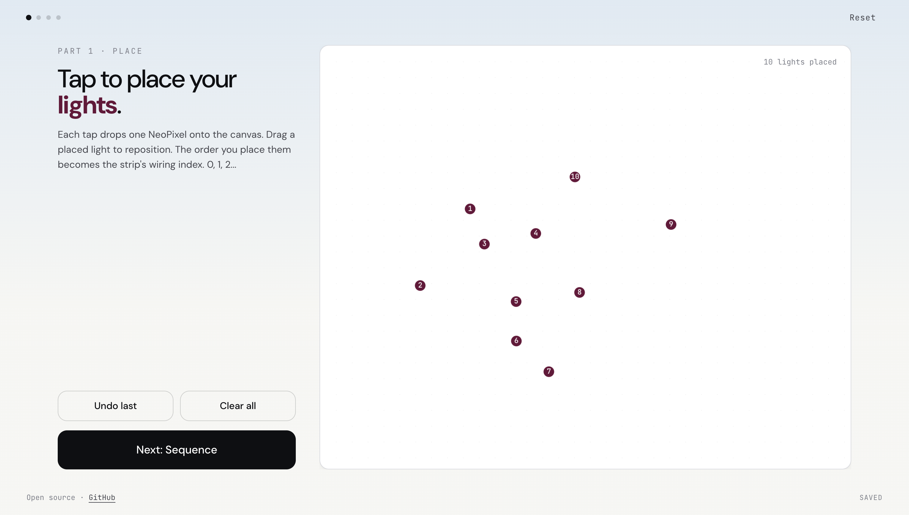
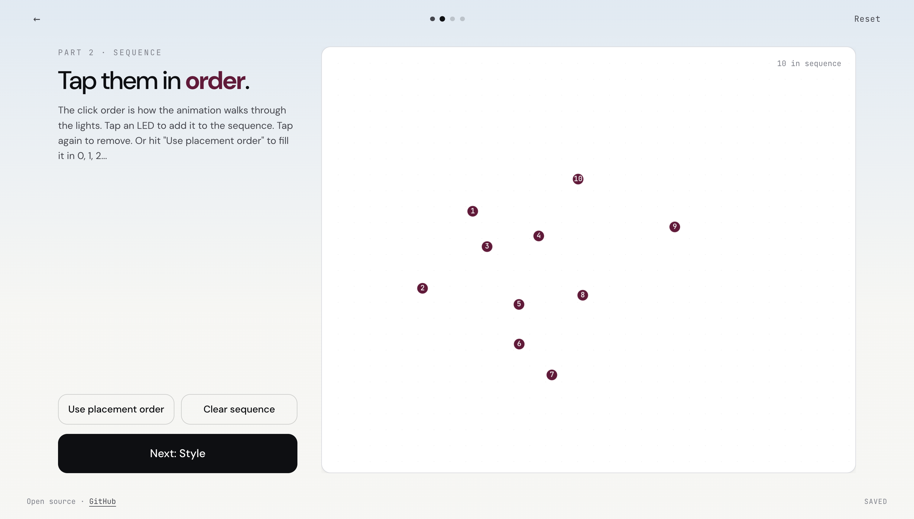
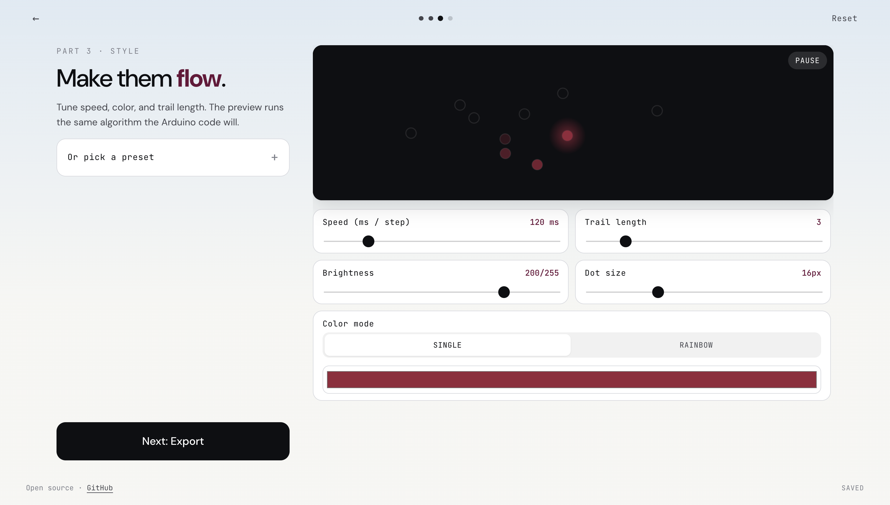
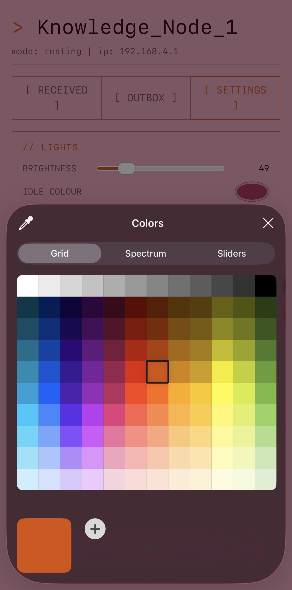
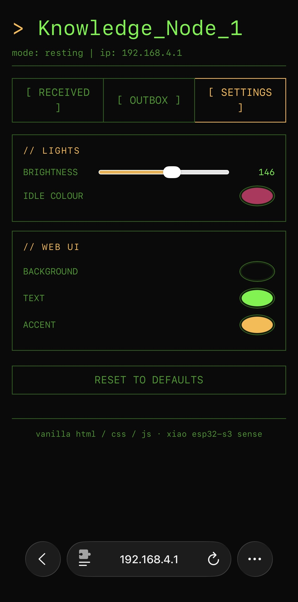

# NeoPixel Planner

[github.com/ineslucas/NeoPixelAnimator](https://github.com/ineslucas/NeoPixelAnimator)

NeoPixel Planner is a dashboard visualizer and planner that outputs NeoPixel library code based on the light sequence you've designed in the browser.

Sketch where each light goes on a canvas. Click them in the order you want the animation to walk through. Tune speed, color, and trail. Copy the generated Arduino sketch into your IDE and flash it.

It's a layer of planning that sits *before* you write any C++. Built on top of (and outputting code for) the [Adafruit NeoPixel library](https://github.com/adafruit/Adafruit_NeoPixel).







## What this solves

Planning LED animations has been a very manual process. You count LEDs, figure out which strip index goes where, sketch on paper or in your head, then translate it into nested for-loops. Lots of room for off-by-one errors. Lots of "wait, was that LED 7 or 8?" moments.

This is not a C++ animation library.

This tool lets you:

1. Visually place lights on a canvas at the rough positions they'll occupy in real life.
2. Define the animation order by clicking them.
3. Watch the animation play in the browser before flashing anything.
4. Get clean Arduino code without manually thinking about indices.

It's an MVP. Future direction: expose this UI over a microcontroller's WiFi access point, so you can adjust animations from your phone with no laptop / IDE in the loop. That would be a Connected Device project.

## Inspiration

- [WLED Calculator](https://wled-calculator.github.io/) by Quindor and the WLED community. Same energy of "small focused web tool that does one thing well for LED tinkerers." The shape of "input some parameters, get usable output" is what I went for.
- [Adafruit NeoPixel library](https://github.com/adafruit/Adafruit_NeoPixel). The actual library this generates code for. Their classic example sketches (chase, theater chase, rainbow) seeded the built-in style presets.

## Stack & why

Vanilla everything. Browser-native Canvas API, plain CSS, ES modules, no libraries.

Reasons:

- Lightweight to eventually run on a microcontroller web server. Very simple, even for the web browser.
- No build step. No `npm install`. Open the folder, serve it, done.
- Responsive by nature, mobile-first. The canvas works on a phone.
- Anyone can read it and remix it.

## Quickstart

### 1. Run it

The simplest way is to open `index.html` in any modern browser.

ES modules need to be served over `http://`, not opened from the filesystem. From the project folder:

```bash
python3 -m http.server 8080
# or
npx serve
```

Then open `http://localhost:8080`.

### 2. Plan an animation

The tool walks you through four steps:

1. **Place.** Tap on the canvas to drop LEDs. Drag to reposition. Each placement gets the next strip wiring index (0, 1, 2, ...).
2. **Sequence.** Tap LEDs in the order you want the animation to fire. Tap again to remove. Or hit "Use placement order" to fill it 0, 1, 2, ... in placement order.
3. **Style.** Choose color, speed, brightness, trail length. Live preview runs the same algorithm the Arduino code will.
4. **Export.** Pick the data pin and LED type, copy the generated sketch, paste into Arduino IDE, flash.

The work auto-saves to the browser. Closing and reopening picks up where you left off.

### 3. Flash it

See [docs/ARDUINO_SETUP.md](docs/ARDUINO_SETUP.md) for wiring, library install, and troubleshooting.

## Deploy it

It's a static site. No backend, no env vars.

- **Vercel.** Drag the project folder onto [vercel.com/new](https://vercel.com/new) and click Deploy.
- **GitHub Pages.** Push to a repo, enable Pages from the repo's Settings.
- **Netlify.** Drag the folder at [app.netlify.com/drop](https://app.netlify.com/drop).

## How the animation works

The planner generates one well-known pattern: a *chase with trail*.

- A "head" position walks forward through your sequence at the chosen interval.
- Behind the head, a configurable number of LEDs fade out (a comet tail).
- All other LEDs are off.

Trail of 0 = a single dot hopping. Trail = sequence length = a full gradient that always fills the strip and rotates.

Color modes:

- **Single.** One color for the whole animation.
- **Rainbow.** Hue cycles 0 → 360° across the sequence.

The browser preview runs the exact same algorithm as the exported Arduino code, so what you see is what you get on real hardware.

## Project layout

```
neopixel-planner/
├── index.html              # Single page, four step sections
├── styles.css              # Vanilla CSS, mobile-first
├── app.js                  # Glue: step routing + button wiring
├── modules/
│   ├── state.js            # Tiny pub/sub store, single source of truth
│   ├── storage.js          # Debounced localStorage persistence
│   ├── canvas.js           # Drawing + tap-to-place + drag-to-move
│   ├── sequence.js         # Sequence helpers (fill / clear / reverse)
│   ├── animation.js        # Live preview engine
│   ├── presets.js          # Built-in style presets
│   └── export.js           # Arduino code generator
└── docs/
    ├── ARDUINO_SETUP.md     # Wiring & flashing
    ├── ADD_PRESET.md        # How to add your own preset
    └── LIBRARY_REFERENCE.md # Module-by-module API reference
```

Each module is small enough to read in one sitting. Comments explain *why*, not *what*.

## Extend it

- **Read the API.** [docs/LIBRARY_REFERENCE.md](docs/LIBRARY_REFERENCE.md) lists every exported function across the modules with signatures and usage notes.
- **Add a preset.** See [docs/ADD_PRESET.md](docs/ADD_PRESET.md). One entry in `modules/presets.js`.
- **Add an effect.** Anything that's "a different way of computing color or position from the sequence" goes in two places: `colorForStep()` in `animation.js` (for the preview) and the matching branch in `export.js` (for the Arduino output). Keep them in lockstep, or the preview lies.
- **Different microcontroller.** The export template lives in `modules/export.js`. Output format is the Adafruit NeoPixel API. Swap the template for FastLED or NeoPixelBus if you need.

See [CONTRIBUTING.md](CONTRIBUTING.md) for guidelines.

## What's not in v1

Cuts I made to keep the MVP shippable. Roadmap candidates:

- **WiFi config / access-point mode.** And changing LED color elements on the fly. Where tool runs on the device, and you design from the web server, available on your phone.

 


- **Per-LED brightness groups.** Was in the original spec but adds significant UI weight. Brightness is currently global.
- **Per-step color picker.** Single + Rainbow cover most cases. The data model already supports per-step (see `state.style.perStepColors`), there's just no picker UI yet.
- **Pattern library.** Save and recall multiple animations on one device. Switch via button or network.
- **Importing layouts.** Paste an SVG, drag in an image, place LEDs along the outline.
- **Multiple strips on multiple pins.**
- **More effects!** Breathing, twinkle, fire, ping-pong.

## License

MIT. See [LICENSE](LICENSE).
